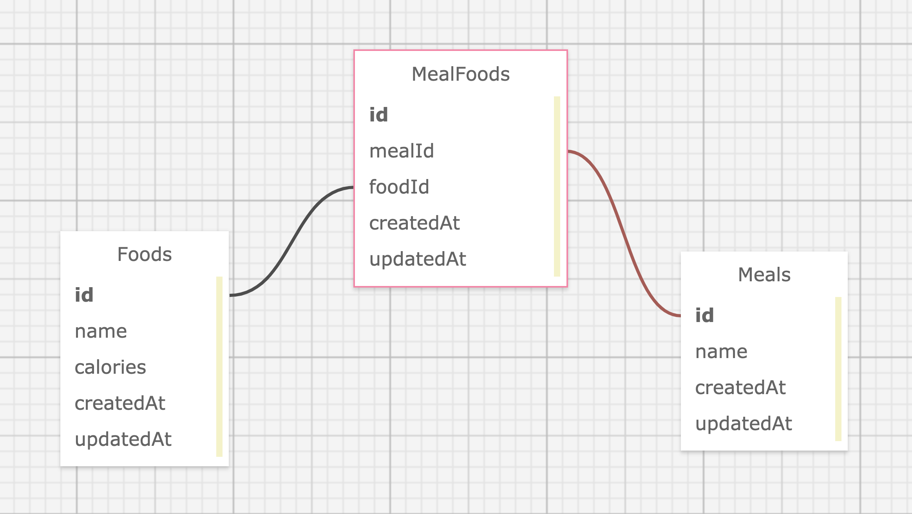

# Project: Quantified Self

## Visit the app on Heroku:
https://damp-lake-24293.herokuapp.com/

## Contributors
* [Sejin Kim](https://github.com/froydroyce)
* [Stella Mainar](https://github.com/smainar)

## About the Project  
* Quantified Self was a paired project completed in 10-days as a requirement for the Turing School of Software and Design, Back-End Engineering Program (Module 4).
* The purpose was to build a tested Express API in JavaScript that users will utilize to track calories in meals that they eat.
* Nine endpoints are exposed (see below).

## Tech Stack
* Express.js
* Node.js
* Sequelize
* Jest
* PostgreSQL
* JavaScript

## Packages Used
* Node-fetch
* Dotenv

## GitHub Repository
https://github.com/froydroyce/quantified_self

## Database Diagram


## Local Setup
  ### Instructions:
      1. Clone the GitHub repository
      2. Go to the directory with the new repo  
      3. Run `npm install`
      4. Setup database:
         a) npx sequelize db:create
         b) npx sequelize db:migrate
      5. To run the server: `npm start`

  ### Run tests:
        1. Run `npm test`
        2. To run a single test file: `npm test -- <file_name>`
        3. To generate coverage report: `open coverage/lcov-report/index.html`


## Endpoints

### Foods Endpoints:

#### 1) User can get all foods currently in database

***Request:***
```
GET /api/v1/foods
Content-Type: application/json
Accept: application/json
```

***Response Example:***
```
status: 200

[
  {
    "id": 1,
    "name": "Banana",
    "calories": 150
  },
  {
    "id": 2,
    "name": "Apple",
    "calories": 100
  },
  {
    "id": 3,
    "name": "Meatloaf",
    "calories": 700
  }
]
```

#### 2) User can get a specific food with an id

***Request:***
```
GET /api/v1/foods/:id
Content-Type: application/json
Accept: application/json
```

***Response Example:***
```
status: 200

{
  "id": 1,
  "name": "Banana",
  "calories": 150
}
```
* Returns 404 if the food is not found

#### 3) User can create a new food

***Request:***
```
POST /api/v1/foods
Content-Type: application/json
Accept: application/json

{ "food":
  { "name": "Pear", "calories": 100 }
}
```

***Response Example:***
```
status: 201
{
    "id": 1,
    "name": "Banana",
    "calories": 150
}
```

* If the food is not successfully created, a 400 status code will be returned. Both name and calories are required fields.

#### 4) User can update existing food

***Request:***
```
PATCH /api/v1/foods/:id
Content-Type: application/json
Accept: application/json

{ "food":
  { "name": "Mint", "calories": "14" }
}
```

***Response Example:***
```
status: 200

{
  "id": 2,
  "name": "Mint",
  "calories": 14
}
```

* If the food is not successfully updated, a 400 status code will be returned.

#### 5) User can delete food

***Request:***
```
DELETE /api/v1/foods/:id
Content-Type: application/json
Accept: application/json
```

* Will delete the food with the id passed in and return a 204 status code. No body will be returned after a deletion.
* If the food can’t be found, a 404 will be returned.

### Meals Endpoints:

#### 6) User can get a list of all meals along with associated

***Request:***
```
GET /api/v1/meals
Content-Type: application/json
Accept: application/json
```

***Response Example:***
```
status: 200

[
  {
    "id": 1,
    "name": "Breakfast",
    "foods": [
      {
        "id": 1,
        "name": "Banana",
        "calories": 150
      },
      {
        "id": 6,
        "name": "Yogurt",
        "calories": 550
      },
      {
        "id": 12,
        "name": "Apple",
        "calories": 220
      }
    ]
  },
  {
    "id": 2,
    "name": "Snack",
    "foods": [
      {
        "id": 1,
        "name": "Banana",
        "calories": 150
      },
      {
        "id": 9,
        "name": "Gum",
        "calories": 50
      },
      {
        "id": 10,
        "name": "Cheese",
        "calories": 400
      }
    ]
  },
  {
    "id": 3,
    "name": "Lunch",
    "foods": [
      {
        "id": 2,
        "name": "Bagel Bites - Four Cheese",
        "calories": 650
      },
      {
        "id": 3,
        "name": "Chicken Burrito",
        "calories": 800
      },
      {
        "id": 12,
        "name": "Apple",
        "calories": 220
      }
    ]
  },
  {
    "id": 4,
    "name": "Dinner",
    "foods": [
      {
        "id": 1,
        "name": "Banana",
        "calories": 150
      },
      {
        "id": 2,
        "name": "Bagel Bites - Four Cheese",
        "calories": 650
      },
      {
        "id": 3,
        "name": "Chicken Burrito",
        "calories": 800
      }
    ]
  }
]
```

#### 7) User can get specific foods associated to a meal

***Request:***
```
GET /api/v1/meals/:meal_id/foods
Content-Type: application/json
Accept: application/json
```

***Response Example:***
```
status: 200

{
  "id": 1,
  "name": "Breakfast",
  "foods": [
    {
      "id": 1,
      "name": "Banana",
      "calories": 150
    },
    {
      "id": 6,
      "name": "Yogurt",
      "calories": 550
    },
    {
      "id": 12,
      "name": "Apple",
      "calories": 220
    }
  ]
}
```

* Returns 404 if the meal is not found

#### 8)  User can add food to a meal

***Request:***
```
POST /api/v1/meals/:meal_id/foods/:id
Content-Type: application/json
Accept: application/json
```

* Adds the food with :id to the meal with :meal_id
* This creates a new record in the MealFoods table to establish the relationship between this food and meal.

***Response Example:***
```
status: 201

{
  "message": "Successfully added FOODNAME to MEALNAME"
}
```

* If the meal/food cannot be found, a 404 will be returned.

#### 9) User can remove food from meal

***Request:***
```
DELETE /api/v1/meals/:meal_id/foods/:id
Content-Type: application/json
Accept: application/json
```

* Removes the food with :id from the meal with :meal_id
* This deletes the existing record in the MealFoods table that creates the relationship between this food and meal.
* If the meal/food cannot be found, a 404 will be returned.
* If successful, this request will return a 204 status code and no body will be present.
